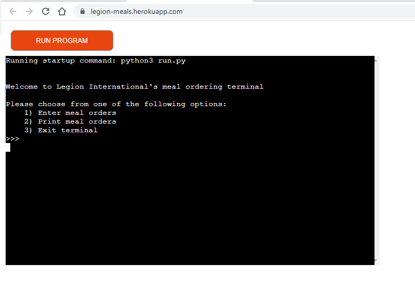

# Meal ordering terminal for Legion international’s flights
------
This project is my third milestone project for Code Institute diploma in Full Stack Software development. You can visit the deployed site [here](https://legion-meals.herokuapp.com/).

The app sends required amount of meals for each flight and special requests for business class passengers to the kitchen and allows the kitchen to pull the data for each flight using googlesheet to store and update order information.

## UX
-------
### User stories

The applications is designed to send orders to the airline’s kitchen facility for individual flights.

As a user, I expect:
•	To easily understand what information is required for input to the application.
•	To be prompted when data input is incorrect.
•	To extract flight meal information required for the specific flight.
•	To easily add flight meal orders.

As a user, I want:
•	To be able to see the date I have input is correct.
•	To easily navigate the application.
•	To be able to add special requests if required.

### Flow Chart

Flow chart
Before beginning this project, I wanted to lay out what I wanted the application to do so I created a flow chart using lucid chart to get the logic in place so the steps to follow could get collated to ensure the application worked correctly. 

## Features
------

### Welcome screen
When the program starts the user is at the welcome screen and is told what the app is for and then user picks from three options to insert data, check data, or exit program.

### Update flight meals
User is directed to enter the flight number, number of passengers and crew for the flight

### Class selections
Once numbers of passengers and crew have been input the data automatically allocates to the corresponding sheet.

Economy and Crew are added together with a further 20 meals added to assure for any incidents that may occur. Then that total number is divided into two equal parts and sent to the spread sheet to the two dishes provided for economy.

Business class total is taken and printed evenly amongst all the Business class dishes

### Special requests
User is prompted to select if any special requests are required for the flight if yes user is asked to fill in the seat number and the request. The user is then taken back to the begining of the speical requests menu to either fill in another request for the flight or exit special requests with a y/n option.

### Check Flight meals

On welcome screen user can select to check the meals required for the flight this then asks user to enter in the flight number details, once entered the flight is printed to the terminal with details of all meals and special requests required.

### End of application
User is taken back to welcome screen to choose from the 3 options at this point user can select exit.

### Data Validation
The application validates all data input to ensure correctness occurs, if Incorrect it prompts the user on how to resolve it.

### Features left to implement.
User able to select specific business class meal for each passenger.

Automatic data pulling
The application eventually would pull flight numbers and passenger details direct from customer when booked and on day of flight kitchen emailed flight meal order to speed the process up.

## Testing

### Technologies Used 

**Languages**
- python
- gspread

**Verion control**
- Git

**Other software**
- Google docs
- Google sheets

### Deployment 
-----
**This application has been deployed using Heroku**
1. Create or sign into a Heroku account
2. Click the Create new app button
3. Choose a name for the app (This needs to be unique)
4. Choose region, then click create app.
5. Click on settings
6. Click reveal config vars button
    - In this project we needed to add a key of PORT and VALUE of 8000
7. Click add.
8. Click add buildpack
   - Add python, save changes
   - Add node.js, save changes
   - make sure python is on top.
9. Go to the deploy tab
10. Choose your deployment method (ours is github)
11. Search for your repository name, then connect
12. You can choose to have automatic deploy on
   - You then click on the manual deploy and wait until you see a finished message saying view app
   - Click the view app button
   - Click the run program button at the top.

## Credits
--------

### Content

All code was written by me with the following exceptions:

•	The code for importing Gspread and setting the SCOPE was adapted from the Code Institute Love Running Code Along project.
•	The code for the update_sheet function was taken from the Code Institute Love Running Code Along project.

**Acknowledgements**

•	My mentor Sandeep for his  feedback and support during the development of the project.
•	Code Institute for giving me the skills through their tutorials to create this app.
•	W3Schools for helping me whenever I got stuck.
